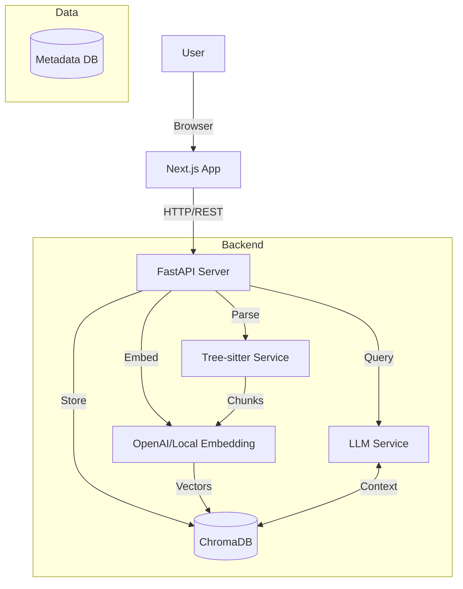

# System Architecture

## Overview

CodebaseQA is designed as a local-first, privacy-focused RAG (Retrieval Augmented Generation) system for codebases. It is split into a Python backend (for ML/RAG capabilities) and a Next.js frontend (for a modern UI).

## High-Level Diagram

## Core Components

### 1. API Layer (FastAPI)
- **Repo Manager**: Handles cloning and file system operations
- **Indexing Service**: Orchestrates parsing, chunking, and embedding
- **Chat Service**: Manages RAG pipeline and streaming responses

### 2. RAG Pipeline
1. **Query Expansion**: Generates multiple variations of user query
2. **Hybrid Search**: Combines vector similarity with keyword matching (BM25-like)
3. **Re-ranking**: Uses LLM to re-rank top chunks for better precision
4. **Context Building**: Formats code blocks with syntax highlighting

### 3. Storage
- **SQLite**: Stores repo metadata, file tree, and chat history
- **ChromaDB**: Stores vector embeddings of code chunks

## Key Design Decisions

### Why separate Backend/Frontend?
To leverage Python's rich ML ecosystem (Tree-sitter, LangChain/LlamaIndex compatibility) while keeping the UI performant and modern with React/Next.js.

### Why Tree-sitter?
Regex-based chunking fails for code. Tree-sitter gives us semantic understanding of code structure (functions, classes) for better chunk boundaries.

### Hybrid Search Strategy
Code retrieval requires exact keyword matching (for variable names) + semantic understanding (for "how does X work"). We combine both to reduce hallucinations.

### Dependency Graph Engine
Dependency graph generation is deterministic-first: the backend extracts import relationships from indexed repository files, computes node/edge metrics, and prunes large graphs with stable ranking so repeated runs remain consistent. For dense repositories, Graph V2.1 supports adaptive module-first entry, scoped file drill-down, and ranked edge budgets for progressive edge reveal. Optional LLM enrichment is used only for concise node descriptions, never as the primary structure source.
